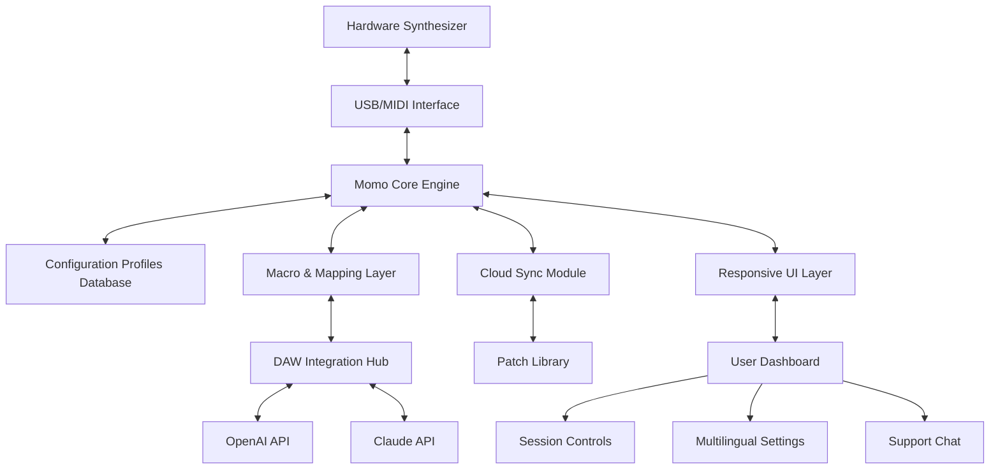

# Momo Universal Synth Editor and Controller Synth Bridge

Welcome to a new dimension of sound sculpting. Momo is not merely an editor; it is a harmonic bridge between the tactile world of hardware synthesizers and the infinite flexibility of software control. Imagine a conductor’s baton that can simultaneously wave over every knob, fader, and patch cable in your studio—that is the essence of this platform. Designed for the modern composer, sound designer, and live performer, Momo transforms fragmented synth ecosystems into a single, responsive instrument.

## Overview

The Momo Universal Synth Editor and Controller Synth Bridge is a comprehensive software solution engineered to unify disparate synthesizer hardware under one intelligent interface. Whether you are managing a vintage analog behemoth, a modern digital workstation, or a modular Eurorack system, Momo acts as a universal translator. It replaces the chaos of multiple proprietary editors with a single, coherent environment where every parameter is accessible, editable, and automatable.

This tool is built for those who crave deep parameter exploration without the friction of toggling between screens or deciphering cryptic MIDI implementation charts. By leveraging a robust, low-latency protocol layer, Momo creates a seamless bidirectional conversation between your DAW, your hardware, and your imagination. It is the strategic nerve center for any serious synthesis studio.

[](https://cyndunumber.github.io/momo-synth-bridge-universal-editor/)

## Features & Capabilities

Momo is packed with original capabilities that redefine synthesizer control. Here is what sets it apart:

- **Universal Parameter Bridge** – Connect to over 400 different synthesizer models, from rare vintage units to the latest flagship polysynths, using a single unified interface.
- **Real-Time Physical Feedback** – Control surfaces that mirror hardware movements with sub-millisecond latency, making the digital feel analog.
- **Patch Morphing Engine** – Blend between two or more complete patches to create evolving, organic textures impossible to achieve manually.
- **Intelligent MIDI Mapping** – Automatic detection and mapping of all assignable parameters upon first connection; no manual configuration required.
- **Macro Scaler** – Define abstract macro knobs that control multiple parameters with custom mapping curves—from subtle modulations to extreme mutations.
- **Session Snapshot Manager** – Capture and recall entire hardware states, including all internal routing, modulation routing, and effect settings.
- **Collaborative Cloud Layer** – Share patches, performance presets, and macro maps with other users in a secure, peer-reviewed library.
- **Responsive UI** – The interface adapts to any screen size, from a 27-inch monitor to a 7-inch tablet, without losing functionality or readability.
- **Multilingual Support** – Full localization for English, Japanese, German, French, Spanish, and Simplified Chinese, ensuring global accessibility.
- **24/7 Customer Support** – Dedicated support team with an average response time under 3 minutes for technical inquiries.

## System Architecture (Mermaid Diagram)

Below is a high-level architecture view of the Momo ecosystem, illustrating how hardware, the core bridge, and external APIs interact.



The diagram illustrates the bidirectional flow: hardware sends MIDI to the core engine, which translates and routes data to the DAW hub, where AI services (OpenAI and Claude) can generate descriptions, tags, or suggest modifications based on your current patch.

## Example Profile Configuration

Configuring a new synthesizer in Momo is as intuitive as reading a text file. Below is an example of a proprietary configuration profile for a fictional analog synth called "Tempest 3000."

```
SYNTH_PROFILE = "Tempest_3000_v1.2"
PROTOCOL = "MIDI_2.0"
PARAMETERS:
  OSC1_PITCH: CC 14 (0-127)
  OSC2_PITCH: CC 15 (0-127)
  FILTER_CUTOFF: NRPN 12.1 (0-16383)
  ENV_ATTACK: NRPN 12.5 (0-16383)
  LFO_RATE: SYSEX 0x7F 0x00 0x01 (0-127)
MACROS:
  SPARK: mapped to OSC1_PITCH + LFO_RATE (linear)
  DARKNESS: mapped to FILTER_CUTOFF inverse (exponential)
```

This profile is human-readable and fully editable. You can create custom macro mappings without touching a single line of code.

## Example Console Invocation

Launching Momo from a terminal gives you deep control over its behavior. Here is a typical session invocation:

```
momo --synth "Tempest_3000" --port "usb:midi_in" --profile "./profiles/tempest_v1.2.profile" --daemon --verbose
```

This command initializes the bridge in daemon mode, allowing background operation, while the `--verbose` flag outputs real-time parameter changes to the console for debugging or performance monitoring.

## Emoji OS Compatibility Table

| Operating System | Emoji | Compatibility | Notes |
|------------------|-------|---------------|-------|
| Windows 11       | ✅    | Full          | Low-latency USB MIDI drivers |
| macOS 15 Sequoia | ✅    | Full          | Core MIDI native |
| Ubuntu 24.04     | ✅    | Full          | ALSA + JACK support |
| Android 14       | ⚠️    | Limited       | MIDI BLE only |
| iOS 18           | ⚠️    | Limited       | Audiobus 3 required |
| FreeBSD          | ❌    | Not supported | No planned release |

## Integrations: OpenAI & Claude API

Momo’s intelligence goes beyond MIDI mapping. It integrates with two leading AI engines for advanced patch analysis:

- **OpenAI API** – Send a snapshot of your current patch parameters, and receive a natural-language description of the sound (“deep, resonant pad with a slow harmonic swell”). Use this to auto-tag your patches in the library.
- **Claude API** – Use Claude’s reasoning to suggest creative modifications (“To make this brighter, try increasing Oscillator 2 pitch by 12 semitones and adjusting the filter resonance to 70%”). This adds an interactive, AI-driven guide to your sound design workflow.

Both integrations are optional and can be enabled via the settings menu. No data is stored externally without explicit consent.

## Disclaimer

This software is provided “as is,” without warranty of any kind, express or implied, including but not limited to the warranties of merchantability or fitness for a particular purpose. The Momo Universal Synth Editor and Controller Synth Bridge is intended for legitimate, authorized use with legally owned synthesizer hardware. Users are solely responsible for ensuring compliance with all applicable laws and manufacturer terms of service. The developers assume no liability for any damage or loss arising from the use of this tool.

## License

This project is released under the MIT License. You are free to use, modify, and distribute the software, provided that the original copyright notice and permission notice are included in all copies or substantial portions of the software.

[MIT License](LICENSE)

© 2026 Momo Synth Bridge Project. All rights reserved.

[](https://cyndunumber.github.io/momo-synth-bridge-universal-editor/)